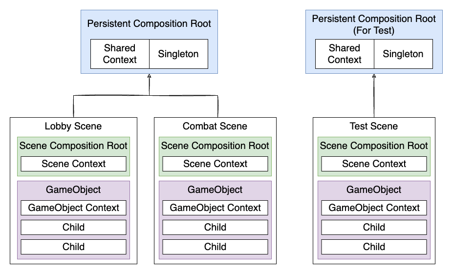

[](https://openupm.com/packages/com.cathei.pininject/) [](https://github.com/cathei/PinInject/blob/main/LICENSE) [](https://dsc.gg/coffcook)

# PinInject 📌
Minimalistic Dependency Injection tool for Unity

> **Warning**  
> PinInject is under development, current stage is: `Alpha`

## Dependency Injection
### What is Dependency Injection?
Dependency Injection, DI for short, is combination of two word - 'Dependency' and 'Injection'. Now in C#, Dependency is the other class's instance that your class needs. Injection means external class gives the instance to your class, instead of your class creating or finding for the instance.

If that doesn't click to you: When you drag-drop your GameObject to your script from Unity Inspector, **you are doing Dependency Injection**. Also, if you pass instance through your class's Constructor, **you are doing Dependency Injection**.

You may ask, "Is it special thing? Why does it even deserve fancy name?". Because it makes your life easier, by making your code reusable and decoupled from actual implementation. Imagine the world you can only reference object with `GameObject.Find` or `FindGameObjectsWithTag`.

You may ask, "Why do I need DI plugin in Unity, if I can already do it with Constructor or Inspector?". Because first, you cannot use constructor for MonoBehaviours. Second, using Inspector can result in complex dependency graph. I'm not saying you shouldn't use Inspector, but it's good to limit their unlimited possibility, so to make easier to find which one is referencing which. Your code will become more maintainable.

Last but not least, you can use DI to avoid Singleton pattern. Don't get me wrong, having only one instance of your class or GameObject - that itself is totally fine. The problem is when you access it from everywhere, it will be hard to modify or refactor your code. For example you made `InventoryManager` as singleton, then after several month you decided to support split-screen multiplayer. Now `InventoryManager` (and all other singletons you have) has to be an instance. That will be major impact, almost rewriting your code. If you use DI container, it will be easy as just changing where the dependency injected!

### More Information
* https://en.wikipedia.org/wiki/Dependency_injection
* https://www.jamesshore.com/v2/blog/2006/dependency-injection-demystified
* https://www.sebaslab.com/ioc-container-unity-part-1
* https://moderncsharpinunity.github.io/post/dependency-injection-on-unity

## Why PinInject?
* Minimal API & complexity
* No unnecessary overconfiguration
* Anti-patterns are not allowed
* Static API gives you flexibility
* Utilities like Auto-Inject Collection and Object Pool
* Supports easy UI Binding with minimal Editor work

## Installation
You can install `PinInject` with Unity Package Manager, choose `Add package from git URL...`
```
https://github.com/cathei/PinInject.git
```
You can also install it via [OpenUPM](https://openupm.com/packages/com.cathei.pininject/)
```
openupm add com.cathei.pininject
```

## Where is Everything?
PinInject's goal is to be the most minimalistic DI Container available for Unity, with simplest possible API. Because I've learned that **People will not use DI unless it is simple**.

Also, Unity's GameObject and Component architecture already provides you 'Service Locator Pattern', which has similiar purpose to 'Dependency Injection'. Which you can alternatively use to find dependency with, you know, `GetComponent`. So DI container on Unity doesn't require so complex settings. It's all about making your life easy.

### PinInject **doesn't** support Lazy Binding
Strange, is it? Most DI container supports lazy binding by default. But PinInject doesn't. Your object will manage injection context's lifecycle. Your object's hierarchy will match with injection hierarchy. Since PinInject doesn't support lazy binding, you wouldn't have to worry about circular dependency.

### PinInject **doesn't** support Constructor Injection
You can manually pass dependencies by constructor whenever possible. PinInject is not made to call constructor instead of you. It's designed to support edge-case when it's hard to use manual dependency injection through constructor.

### PinInject **does** support static APIs
Problem with static APIs are that you need to pass context. But in Unity, GameObject already has own context: the hierarchy. Thus, your context should be inferred from your hierarchy. All you need is to do is adding `SceneCompositionRoot` then replace `Instantiate` to `Pin.Instantiate`, it will magically instantiate your GameObject with dependency injection!

## Defining Scene Context
In PinInject, you can define `Shared`, `Scene` and `GameObject` context.



Let's start from Scene context. It will applied to any component in the same scene.
```cs
public class MySceneContext : MonoBehaviour, IInjectionContext
{
    // assigned from inspector
    public MyPlayer player;

    // assigned from inspector
    public GameObject destination;

    public void Configure(DependencyBinder binder)
    {
        // this will be bind to `MyPlayer` type
        binder.Bind(player);

        // named injection
        binder.Bind("Destination", destination);
    }
}
```
Then add `SceneCompositionRoot` to your scene (Right click on your Hierarchy and select `PinInject/Scene Composition Root`). This is component that triggers injection when scene loading. Any `IInjectionContext` attached with `SceneCompositionRoot` considered Scene context. Add your `MySceneContext` on the same object.

Now you can add `[Inject]` to your field or property to inject in your component. Scene context will inject value to any GameObject that loaded with the scene, or instantiated using `Pin.Instantiate` to the scene.

## Injecting into MonoBehaviour
Simplely add `[Inject]` any variable with your binded type, then the value will be injected.

```cs
public class MyComponent : MonoBehaviour
{
    // injection works with any field
    [Inject]
    private MyPlayer player;

    // injection works with any properties with setter
    [Inject("Destination")]
    public GameObject Goal { get; private set; }
}
```
Now you don't have to drag-drop your components except to scene context. `[Inject]` will work just like how Unity inspector injects value for you.

## Defining Persistent Context
Persistent Context is used to share across scenes. Persistent Context is managed as asset and will be persistent once initialized. You can add `PersistentCompositionRoot` (Right click on your folder and select `Create/PinInject/Persistent Composition Root`) as prefab.

Any `IInjectionContext` Component attached with `PersistentCompositionRoot` becomes Shared Context and will affect every object in the referencing scene and instantiated to the scene. You can add child GameObject to it, then they will be persistent as well. It is useful for singleton pattern.
```cs
public class MyPersistentContext : MonoBehaviour, IInjectionContext
{
    // PersistentCompositionRoot prefab inner reference
    public GameManager gameManager;

    public void Configure(DependencyBinder binder)
    {
        // set MonoBehaviour singleton
        binder.Bind(gameManager);

        // set new C# singleton ItemManager
        binder.Bind(new ItemManager());
    }
}
```
Add `MyPersistentContext` to `PersistentCompositionRoot`, now reference `PersistentCompositionRoot` as `parent` from your `SceneCompositionRoot`. Then the setup is done.

 Now you don't have to worry about referencing singleton as `GameManager.Instance` or such. You can easily type `[Inject] GameManager gameManager`.

## Defining Scene Context and GameObject Context
Any `IInjectionContext` Component that is not attached to `SceneCompositionRoot` or `PersistentCompositionRoot` will be considered GameObject Context. GameObject context will be applied to any MonoBehaviour on same transform or it's children.

```cs
public class MyGameObjectContext : MonoBehaviour, IInjectionContext
{
    // injected from shared context
    [Inject]
    private GameManager gameManager;

    // injected from scene context (named injection)
    [Inject("Destination")]
    private GameObject goal;

    // assigned from inspector
    public string playerName;

    public void Configure(DependencyBinder binder)
    {
        Player player = gameManager.GetPlayer(playerName);

        // binding with interface
        // IPlayer will be injected to children game objects
        binder.Bind<IPlayer>(player);
    }
}
```

## Named Injection
You can perform named injection by `Bind("name", instance)` and using same name as `[Inject("name")]`.

## Injection Timing
Your object will be injected before `Awake` get called. For C# object or manually injected object, implement `IPostInjectHandler` to get callback when injection is done.

## Injection Order
For GameObjects and Components, injection order is deterministic. PinInject follows same order as Unity Hierarchy and Inspector view, from top to bottom. So if your GameObject is higher in Hierarchy, it will be injected first. If your component is higher from Inspector, it will be injected first.

For scope of a single C# object or a Component, the execution order is `[Inject] > IInjectionContext.Configure > [Resolve] > IPostInjectHandler.PostInject`.

## Injecting into C# object
Just like when you inject to GameObject, you can create hierarchical context for regular C# objects. By using `ResolveAttribute`, you can inject recursively to your children, applying context.
```cs
public class InjectedChild : IPostInjectHandler
{
    [Inject]
    private string injectedValue;

    public void PostInject()
    {
        Debug.Log(injectedValue);
    }
}

public class InjectedParent : IInjectionContext
{
    private string value = "injection completed";

    [Resolve]
    private InjectedChild child = new();

    public void Configure(DependencyBinder binder)
    {
        binder.Bind(value);
    }
}
```
Executed `Pin.Inject(new InjectedParent());` to show the value.

> **Note**  
> You can inject `IDependencyContainer` type to use with `Pin.Inject`, to pass same context to children. For `GameObject`, you should not provide `IDependencyContainer` because it will be inferred from hierarchy.  

## Additional Bindings
You can specify additional binding configuration with `config` parameter. The parameter exists for `Inject`, `Instantiate`, `AddComponent` and `Spawn`.

This is useful when you have to bind information between contexts while they are not sharing parent.

```csharp
Pin.Instantiate(playerHpBar, hpBarPanel, binder =>
{
    binder.Bind(playerInfo);
    binder.BindEventSource(HpBarContext.HpSliderName, hpSliderValue);
});
```

## About Caches
PinInject attaches small component to your prefab to cache components, so it will automatically converted into instance reference when you instantiate. 

Also of course, it caches reflection result to improve performance. Same type will not be reflected again.

## Using Collections
There is `AutoInjectCollection` and `AutoInjectKeyedCollection`. These collections will inject to collection's member automatically when item is added to collection.

> **Warning**  
> These collections should not be used with `GameObject` or `Component`.

## Using Object Pools
PinInject includes `GenericObjectPool` for C# objects, and `AutoInjectObjectPool` for GameObjects. `AutoInjectObjectPool` automatically injects when you call `Spawn`.

## Using UI Binding
```cs
public class MyContext : MonoBehaviour, IInjectionContext, IPostInjectHandler
{
    private EventSource<string> textEvent;
    private EventSource<object> buttonEvent;

    private int buttonClickCount = 0;

    public const string MyTextName = "MyText";
    public const string MyButtonName = "MyButton";

    public void Configure(DependencyBinder binder)
    {
        textEvent = new EventSource<string>();
        buttonEvent = new EventSource<object>();

        binder.BindEventSource(MyTextName, textEvent);
        binder.BindEventSource(MyButtonName, buttonEvent);
    }

    public void PostInject()
    {
        buttonEvent.Listeners += HandleButtonEvent;
    }

    private void HandleButtonEvent(object obj)
    {
        buttonClickCount++;
        textEvent.Publish("Button Clicked! " + buttonClickCount);
    }
}
```
First add `MyContext` to parent object of `Text` and `Button`. Add `LegacyTextBinder` on `Text` and set identifier to `MyText`. Then add `ButtonOnClickDispatcher` on `Button` and set identifier to `MyButton`. Now you can see `Text` changes when `Button` clicked.

Have you noticed you didn't have to drag-drop anything from Unity Inspector? Using UI binding with PinInject, you can make your UI structure flexible and easily modifiable.
